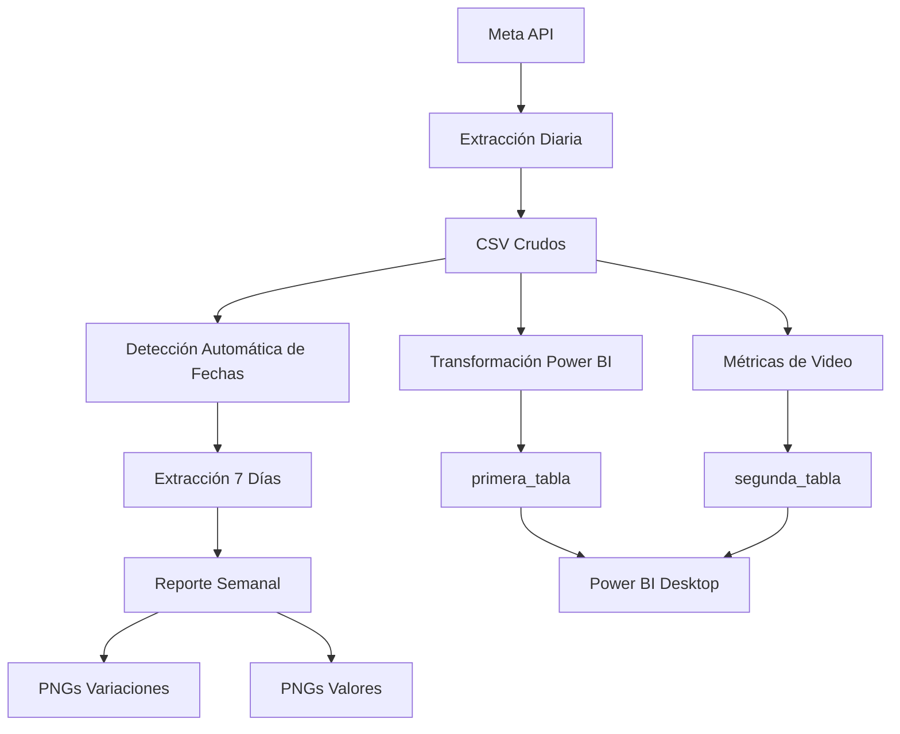

# 🚀 Meta Ads Dashboard Power BI

> **Automatización inteligente de datos de campañas de Meta para análisis avanzado en Power BI**

---

## 🎯 Misión

Transformar datos brutos de campañas de Meta en insights accionables que permitan optimizar el rendimiento publicitario y tomar decisiones basadas en datos reales.

---

## ✨ Características Principales

### 🔥 **Extracción Automática**
- **Detección inteligente** de última fecha disponible
- **Extracción incremental** de siguientes 7 días
- **Manejo robusto** de errores de API
- **Backups automáticos** para protección de datos

### 📊 **Reportes Visuales**
- **Generación automática** de reportes semanales
- **PNGs profesionales** con métricas clave
- **Comparaciones temporales** (semana anterior, mes anterior, año anterior)
- **Detección automática** de períodos disponibles

### 🔄 **Transformación ETL**
- **`primera_tabla`**: Datos de campañas optimizados para Power BI
- **`segunda_tabla`**: Métricas de video a nivel de anuncio
- **Variables globales** disponibles directamente en Power BI Desktop
- **Limpieza y normalización** automática de datos

### 🧠 **Logging Inteligente**
- **Detección automática** de entorno (Power BI vs terminal)
- **Logs con timestamp** para auditoría completa
- **Salida adaptable** según contexto de ejecución

---

## 🛠️ Arquitectura del Sistema



---

## 📋 Dataframes Disponibles

### 🎯 **`primera_tabla`** - Campañas Nivel Campaign
| Métrica | Tipo | Descripción |
|----------|------|-------------|
| **Inversión** | 💰 | spend, impressions, reach |
| **Engagement** | 👆 | clicks_all, link_clicks, CTR |
| **Conversión** | 💬 | first_replies, two_way_conversations |
| **Video** | 🎥 | video_25pct, reach |
| **Identificación** | 🏷️ | account, campaign_id, campaign_name |

### 🎬 **`segunda_tabla`** - Métricas de Video Nivel Anuncio
| Métrica | Tipo | Descripción |
|----------|------|-------------|
| **Rendimiento** | 📊 | impressions, video_plays |
| **Retención** | ⏱️ | video_3s_views, retention_3s_pct |
| **Completitud** | ✅ | video_100pct_views, retention_complete_pct |
| **Curva API** | 📈 | curve_3s_pct_api, thruplay |

---

## 🚀 Quick Start

### 🎯 **Para Principiantes**
```bash
# 1. Clonar el repositorio
git clone https://github.com/tu-usuario/meta-analytics-suite.git

# 2. Instalar dependencias
pip install pandas numpy matplotlib facebook-business python-dateutil

# 3. Configurar variables de entorno
export META_APP_ID="tu_app_id"
export META_APP_SECRET="tu_app_secret" 
export META_ACCESS_TOKEN="tu_access_token"

# 4. Ejecutar
python scripts/a01.py
```

### 🔥 **Para Power BI Desktop**
1. 📋 Copiar todo el código del script
2. 🎯 Ejecutar en el editor de Python
3. 📊 Usar `primera_tabla` y `segunda_tabla`
4. 📈 Crear visualizaciones increíbles

---

## 📁 Estructura de Proyecto

```
📂 meta-analytics-suite/
├── 📂 scripts/
│   ├── 🐍 a01.py              # Script principal completo
│   ├── 📊 transform_raw.py      # Transformación base
│   └── 🎬 dlc_1.py            # Métricas de video
├── 📂 campaign/
│   ├── 📂 data/
│   │   ├── 📄 campaign_1d           # Datos crudos
│   │   └── 📄 campaign_1d_backup_*.csv
│   └── 📂 data_powerbi/
│       ├── 📄 powerbi_ready.csv
│       └── 📄 campaign_video_3s_100pct_1d_ads.csv
├── 📂 reporte_semanal/
│   ├── 📂 insight/
│   │   ├── 📄 tabla_variaciones.png
│   │   └── 📄 tabla_valores.png
│   └── 📂 logs/
│       └── 📄 meta_extractor_*.log
├── 📄 README.md                    # Este archivo
└── 📄 .gitignore                   # Archivos ignorados
```

---

## 🎨 Casos de Uso

### 📈 **Análisis de Rendimiento**
```python
# En Power BI Desktop
primeras_tabla.groupby('account')['spend'].sum()
segunda_tabla[segunda_tabla['retention_3s_pct'] > 0.5]
```

### 🎯 **Optimización de Campañas**
- Identificar campañas con CTR > 2%
- Analizar retención de video > 60%
- Comparar CPL entre cuentas (tla vs illapa)

### 📊 **Reportes Automáticos**
- Semanales: Variaciones y tendencias
- Diarios: Extracción incremental
- Mensuales: Consolidación automática

---

## 🔧 Configuración Avanzada

### 🌍 **Variables de Entorno**
> **⚠️ Importante**: Las credenciales de Meta son privadas y no deben compartirse
> 
> **Recomendación**: Configurar como variables de entorno del sistema

```bash
# Forma segura (recomendado)
export META_APP_ID="tu_app_id"
export META_APP_SECRET="tu_app_secret" 
export META_ACCESS_TOKEN="tu_access_token"

# Nota: Las credenciales en el código son solo para desarrollo
# En producción, usar siempre variables de entorno
```

### 📊 **Personalización de Métricas**
```python
# Modificar metric_map para cambiar nombres
metric_map = {
    'spend': 'Inversión Total',
    'ctr': 'Tasa de Clics',
    # ... personalizar según necesidad
}
```

---

## 🚨 Manejo de Errores

| Error | Solución | Causa |
|--------|-----------|---------|
| **CSV no encontrado** | Verificar path o ejecutar extracción inicial | Archivo no existe |
| **Token inválido** | Renovar token de Meta | Expiración de credenciales |
| **Error de API** | Reintentos automáticos con backoff | Límites de rate limiting |
| **Fechas inválidas** | Validar START_DATE < END_DATE | Configuración incorrecta |

---

## 🔄 Flujo de Automatización

### 🌅 **Diario (Recomendado)**
```bash
# Cron job para extracción diaria
0 8 * * * python /path/to/a01.py
```

### 📊 **Semanal**
```bash
# Reportes automáticos cada lunes
0 9 * * 1 python /path/to/a01.py
```

### 📈 **Mensual**
```bash
# Consolidación y limpieza mensual
0 6 1 * * python /path/to/cleanup.py
```

---

## 🎯 Métricas Clave

### 💰 **Métricas de Negocio**
- **ROAS**: Return on Ad Spend
- **CPL**: Cost per Lead  
- **CTR**: Click-through Rate
- **Conversion Rate**: Leads / Impresiones

### 🎬 **Métricas de Video**
- **Retención 3s**: % que llega a 3 segundos
- **Completitud**: % que ve el 100%
- **Thruplay**: Vistas completas totales

### 📈 **Métricas de Tendencia**
- **Variación semanal**: Cambio vs semana anterior
- **Crecimiento mensual**: Comparación mismo mes anterior
- **YoY**: Year over Year growth

---

## 🚀 Roadmap

### ✅ **Versión 1.0** (Actual)
- [x] Extracción automática de datos
- [x] Reportes semanales con PNGs
- [x] Transformación para Power BI
- [x] Métricas de video nivel anuncio
- [x] Logging inteligente

### 🚀 **Versión 2.0** (Planeada)
- [ ] Dashboard automático web
- [ ] Alertas de rendimiento
- [ ] Integración con Google Analytics
- [ ] Predicciones con ML

### 🎯 **Versión 3.0** (Futura)
- [ ] Optimización automática de presupuestos
- [ ] A/B testing integrado
- [ ] API REST para consumo externo
- [ ] Interfaz web de configuración

---

## 🤝 Contribuir

### 🎯 **Cómo Ayudar**
1. **🍴 Fork** el repositorio
2. **🌿 Feature Branch**: `git checkout -b feature/AmazingFeature`
3. **💻 Commit**: `git commit -m 'Add Amazing Feature'`
4. **🚀 Push**: `git push origin feature/AmazingFeature`
5. **📋 Pull Request**: Explicar beneficios y uso

### 🏆 **Áreas de Mejora**
- **Performance**: Optimizar consultas a API
- **UI/UX**: Mejorar visualizaciones
- **Documentation**: Expandir guías de uso
- **Testing**: Agregar tests unitarios

---

## 📄 Licencia

> **Uso Interno** - Este proyecto está diseñado para análisis interno de campañas de Meta.
> 
> **Consultar** con el equipo antes de uso externo o distribución.

---

## 📞 Soporte

### 🆘 **Problemas Comunes**
- **🔑 Tokens**: Revisar variables de entorno
- **📂 Paths**: Verificar rutas absolutas
- **🌐 API**: Validar conexión a internet
- **💾 Memoria**: Reiniciar si hay lentitud

### 📚 **Recursos**
- **📖 Wiki**: Documentación detallada
- **🎥 Tutoriales**: Videos de configuración
- **💬 Issues**: Reportar problemas en GitHub
- **📧 Debug**: Modo desarrollo con logs extendidos

---

<div align="center">

### 🚀 **Hecho con ❤️ para análisis de datos de Meta**

*Transformando datos brutos en insights accionables*

</div>
